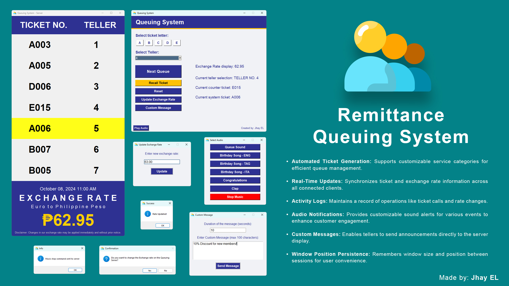

<!DOCTYPE html>
<html lang="en">
<head>
    <meta charset="UTF-8">
    <title>Remittance Queuing System - README</title>
</head>
<body>

<h1>Remittance Queuing System</h1>

The <strong>Remittance Queuing System</strong> is a Python-based client-server application designed to streamline customer service operations in remittance centers and similar business environments. Utilizing Tkinter for the graphical user interface (GUI) and socket programming for real-time communication over a local network, this system enhances teller efficiency and improves the overall customer experience by effectively managing queues.

<h2>Table of Contents</h2>
<ul>
    <li><a href="#features">Features</a></li>
    <li><a href="#project-structure">Project Structure</a></li>
    <li><a href="#getting-started">Getting Started</a>
        <ul>
            <li><a href="#prerequisites">Prerequisites</a></li>
            <li><a href="#installation">Installation</a></li>
        </ul>
    </li>
    <li><a href="#configuration">Configuration</a></li>
    <li><a href="#usage">Usage</a>
        <ul>
            <li><a href="#running-the-server">Running the Server</a></li>
            <li><a href="#running-the-client">Running the Client</a></li>
        </ul>
    </li>
    <li><a href="#screenshots">Screenshots</a></li>
    <li><a href="#troubleshooting">Troubleshooting</a></li>
    <li><a href="#acknowledgments">Acknowledgments</a></li>
</ul>

<h2 id="features">Features</h2>
<ul>
    <li><strong>Local Network Client-Server Architecture:</strong> Supports multiple teller interfaces connected to a central server over a local network for synchronized queue management.</li>
    <li><strong>User-Friendly GUI:</strong> Intuitive interfaces designed with Tkinter, featuring responsive layouts and easy navigation.</li>
    <li><strong>Efficient Queue Management:</strong>
        <ul>
            <li>Automated ticket generation with customizable service categories (A-E).</li>
            <li>Real-time updates: Broadcasts ticket updates and exchange rates to all connected clients instantly.</li>
            <li>Activity log: Maintains a log for operations like ticket calls and rate changes.</li>
        </ul>
    </li>
    <li><strong>Audio Notifications:</strong> Plays customizable sound alerts for events using Pygame.</li>
    <li><strong>Exchange Rate Display:</strong> Allows tellers to update exchange rates, which are displayed on the server screen and all clients.</li>
    <li><strong>Custom Messages:</strong> Supports sending custom messages to the server display for announcements or promotions.</li>
    <li><strong>Window Position Persistence:</strong> Remembers window size and position between sessions for user convenience.</li>
    <li><strong>Security Features:</strong>
        <ul>
            <li>Password-protected settings and actions to prevent unauthorized changes.</li>
            <li>Option to clear activity logs with confirmation and password verification.</li>
        </ul>
    </li>
    <li><strong>Error Handling and Logging:</strong> Robust error management with detailed logging for troubleshooting.</li>
</ul>

<h2 id="project-structure">Project Structure</h2>

Here's the file structure of the project:

<pre>
Remittance-Queuing-System/
├── client.py
├── server.py
├── README.md
├── res/
│   ├── git-introduction.jpeg
│   ├── mipmap/
│   │   ├── Icon.ico
│   │   └── Icon.svg
│   └── sounds/
│       ├── 01erupdated.mp3
│       ├── announcement.mp3
│       ├── buon-compleanno.mp3
│       ├── clapping.mp3
│       ├── congratulations.mp3
│       ├── erupdated.mp3
│       ├── HBD Song.mp3
│       ├── maligayang-bati.mp3
│       └── Queueing Sound.mp3
</pre>

<ul>
    <li><strong>client.py:</strong> The client-side application used by tellers to manage queues.</li>
    <li><strong>server.py:</strong> The server-side application that handles incoming connections and coordinates the queue system.</li>
    <li><strong>README.md:</strong> Documentation file containing information about the project.</li>
    <li><strong>res/:</strong> Resource directory containing images and sounds.
        <ul>
            <li><strong>git-introduction.jpeg:</strong> Image used in the introduction section of this README.</li>
            <li><strong>mipmap/:</strong> Contains icon files for the application.
                <ul>
                    <li><strong>Icon.ico:</strong> Icon file used by the application on Windows.</li>
                    <li><strong>Icon.svg:</strong> Scalable vector icon for the application.</li>
                </ul>
            </li>
            <li><strong>sounds/:</strong> Contains audio files used for notifications.
                <ul>
                    <li><strong>01erupdated.mp3, erupdated.mp3:</strong> Sounds played when the exchange rate is updated.</li>
                    <li><strong>announcement.mp3:</strong> Sound played during custom announcements.</li>
                    <li><strong>buon-compleanno.mp3, HBD Song.mp3, maligayang-bati.mp3:</strong> Birthday songs in different languages.</li>
                    <li><strong>clapping.mp3, congratulations.mp3:</strong> Sounds for applause and congratulations.</li>
                    <li><strong>Queueing Sound.mp3:</strong> Default sound played when calling the next ticket.</li>
                </ul>
            </li>
        </ul>
    </li>
</ul>

<h2 id="getting-started">Getting Started</h2>

<h3 id="prerequisites">Prerequisites</h3>
<ul>
    <li><strong>Python 3.x</strong> installed on all machines running the client or server applications.</li>
    <li>Required Python libraries:
        <ul>
            <li><code>tkinter</code> (usually included with Python)</li>
            <li><code>pygame</code></li>
            <li><code>socket</code> (standard library)</li>
            <li><code>threading</code> (standard library)</li>
            <li><code>logging</code> (standard library)</li>
        </ul>
    </li>
    <li>All machines must be connected to the same local network.</li>
</ul>

<h3 id="installation">Installation</h3>
<ol>
    <li><strong>Clone the Repository:</strong>
        <pre>git clone https://github.com/yourusername/Remittance-Queuing-System.git</pre>
    </li>
    <li><strong>Navigate to the Project Directory:</strong>
        <pre>cd Remittance-Queuing-System</pre>
    </li>
    <li><strong>Install Dependencies:</strong>
        <pre>pip install -r requirements.txt</pre>
        
If a <code>requirements.txt</code> file is not provided, install the necessary packages individually:

        <pre>pip install pygame</pre>
    </li>
</ol>

<h2 id="configuration">Configuration</h2>

Since the system operates over a local network, you need to configure the IP addresses for client-server communication.

<h3>Server Configuration</h3>
<ul>
    <li>By default, the server listens on all network interfaces (0.0.0.0) on port <code>58148</code>.</li>
    <li>No additional configuration is needed unless you want to change the port or bind to a specific interface.</li>
</ul>

<h3>Client Configuration</h3>
<ul>
    <li>On first launch, the client application will prompt for the server's IP address.</li>
    <li>Enter the local IP address of the machine running the server application.</li>
    <li>The IP address is saved in a file named <code>server_ip.txt</code> for future use.</li>
    <li>If the server's IP address changes, you can edit or delete <code>server_ip.txt</code> to re-enter the IP address on the next launch.</li>
</ul>

<h2 id="usage">Usage</h2>

<h3 id="running-the-server">Running the Server</h3>
<ol>
    <li><strong>Navigate to the Project Directory:</strong>
        <pre>cd Remittance-Queuing-System</pre>
    </li>
    <li><strong>Run the Server Application:</strong>
        <pre>python server.py</pre>
        
The server will start listening on port <code>58148</code> and display a GUI window showing the current queue status.

    </li>
</ol>

<h3 id="running-the-client">Running the Client</h3>
<ol>
    <li><strong>On Each Teller's Machine:</strong> Ensure the machine is connected to the same local network as the server.</li>
    <li><strong>Navigate to the Project Directory:</strong>
        <pre>cd Remittance-Queuing-System</pre>
    </li>
    <li><strong>Run the Client Application:</strong>
        <pre>python client.py</pre>
    </li>
    <li><strong>Configure Server IP:</strong>
        <ul>
            <li>Upon first run, a prompt will appear to enter the server's IP address.</li>
            <li>Enter the local IP address where the server application is running (e.g., <code>192.168.1.100</code>).</li>
        </ul>
    </li>
    <li><strong>Use the Client Interface:</strong>
        <ul>
            <li><strong>Select Teller Number:</strong> Choose your teller number from the dropdown.</li>
            <li><strong>Select Ticket Letter:</strong> Choose the ticket category (A-E) you will be serving.</li>
            <li><strong>Next Queue:</strong> Click to call the next ticket.</li>
            <li><strong>Recall Ticket:</strong> Click to recall the last called ticket.</li>
            <li><strong>Update Exchange Rate:</strong> Update the exchange rate displayed on all screens.</li>
            <li><strong>Custom Message:</strong> Send a custom message to be displayed on the server screen.</li>
            <li><strong>Activity Log:</strong> View the log of recent activities.</li>
        </ul>
    </li>
</ol>

<h2 id="screenshots">Screenshots</h2>

<h3>Server Interface</h3>

The server displays current tickets, tellers, exchange rates, and custom messages.

<h3>Client Interface</h3>

Tellers use the client interface to manage queues and perform operations.

<h2 id="troubleshooting">Troubleshooting</h2>

<ul>
    <li><strong>Unable to Connect to Server:</strong>
        <ul>
            <li>Ensure that the server application is running and listening on the correct port (<code>58148</code> by default).</li>
            <li>Verify the server's local IP address and make sure it is accessible from the client's machine.</li>
            <li>Check for any firewall settings that might be blocking the connection.</li>
            <li>Ensure all devices are connected to the same local network.</li>
        </ul>
    </li>
    <li><strong>Missing Resources:</strong>
        <ul>
            <li>Make sure that all resource files (icons, images, sounds) are present in the correct directories as per the project structure.</li>
            <li>If running the application from a different directory, update the file paths accordingly or use relative paths.</li>
        </ul>
    </li>
    <li><strong>Audio Playback Issues:</strong>
        <ul>
            <li>Ensure that <code>pygame</code> is installed correctly.</li>
            <li>Verify that the sound files are not corrupted and are in the correct format.</li>
            <li>Check the system's audio settings to ensure sound output is enabled.</li>
        </ul>
    </li>
    <li><strong>Permission Errors:</strong>
        <ul>
            <li>Run the applications with appropriate permissions, especially if accessing network resources or modifying files.</li>
            <li>On Windows, you might need to run the applications as an administrator.</li>
        </ul>
    </li>
    <li><strong>Window Position Issues:</strong>
        <ul>
            <li>If the application window opens off-screen, delete the <code>window_position.txt</code> file to reset the window position.</li>
        </ul>
    </li>
</ul>

<h2 id="acknowledgments">Acknowledgments</h2>
<ul>
    <li><strong>Tkinter:</strong> For providing a robust GUI toolkit for Python.</li>
    <li><strong>Pygame:</strong> For handling audio playback in the application.</li>
    <li><strong>OpenAI's ChatGPT:</strong> For assistance in refining and documenting the project.</li>
</ul>

</body>
</html>
